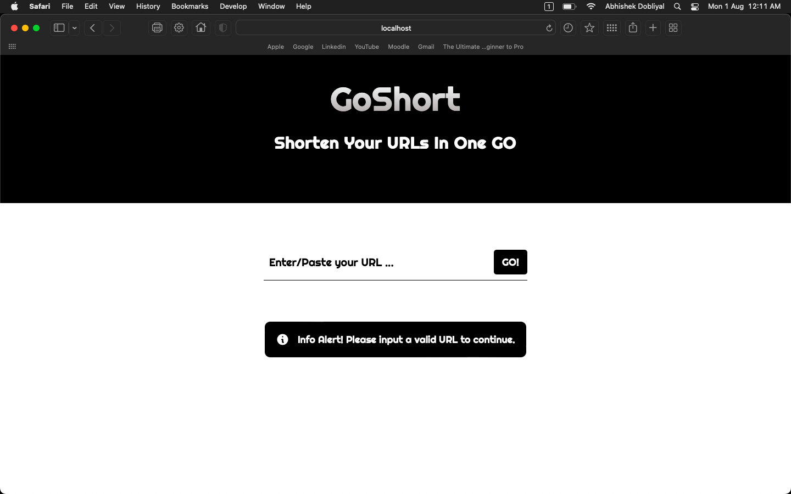

# GoShort
A web app to shorten URLs.

  


### Installation & Requirements

- [NodeJS](https://nodejs.org/en/)
- [VueJS](https://www.npmjs.com/package/vue)
- [GoLang](https://go.dev/)

### Usage

- Navigate to the project directory and inside the `api` folder open up the Terminal/Command Prompt and type in
```bash
go run main.go
```

- Once the `fiber` server starts running, navigate to the `frontend` folder and type in
```bash
npm run serve
```

> This will start a development server.

### To-Do

- [ ] Add wait time animation
- [ ] Add notification sound 
- [ ] Fix issues (if any)
